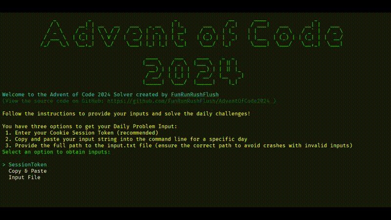
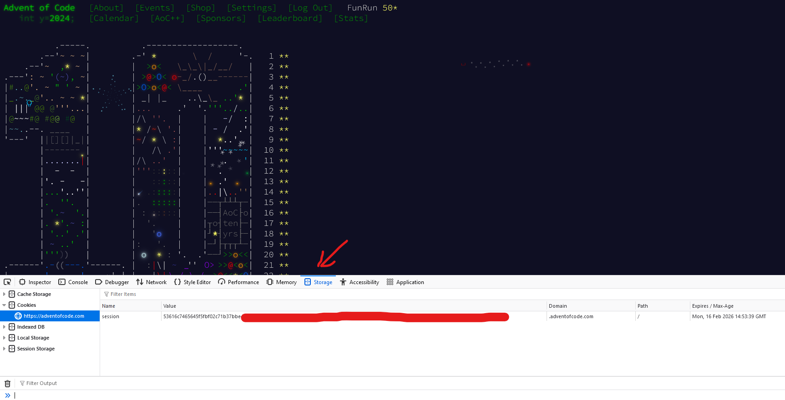

# Advent of Code 2024 Solver


A **C# application** designed to solve the daily challenges of Advent of Code 2024.
This tool is equipped with (some) animations, benchmarks, and interactive input options to make solving challenges engaging

---

## Features

- **Interactive Input Options**: Supports session tokens, file uploads, or manual input.
- **Solution**: Analyze the performance of your solutions with detailed reports.
- **Solution Animations**: Watch step-by-step solutions in action. (only few implemted right now)


## 📸 Overview





### 🛠 Input Options

- **Session Token**: Automatically loads all inputs for the year (~135 characters long).
- **Manual Input**: Enter input directly in the terminal.
- **File Input**: Provide a file path to your input file.

> **Info**: To obtain your session token, log in to [Advent of Code](https://adventofcode.com/), open the Developer Console (F12), navigate to **Storage** > **Cookies**, and locate the `session` token.




## 📚 How to Use

### 1. Clone the Repository
```bash
git clone https://github.com/FunRunRushFlush/AdventOfCode2024Solver.git
cd AdventOfCode2024Solver/2024
```

### 2. Build the Project

```bash
dotnet build
```

### 3. Run the Solver

#### Basic Usage
Run the program to solve daily challenges interactively:
```bash
dotnet run
```

#### Benchmark Mode
To analyze performance:
```bash
dotnet run -c Release --benchmark
```

> **Note**: Benchmarking requires the following setup:
> - **Release mode**: Benchmarking requires the Release setup
> - **Input Files**: Ensure files are located in `Days/{Day}/InputData/Input.txt`. Each file should contain the appropriate input data for the specific day. (I still need to find a better solution)

---

## 📝 Contributing / Using

Feel free to add animations or improve existing ones:
1. Fork the repository.
2. Create a feature branch: `git checkout -b my-feature`.
3. Commit your changes: `git commit -am 'Add some feature'.`
4. Push the branch: `git push origin my-feature`.
5. Open a pull request.

---

## 🏷 License

This project is licensed under the MIT License.

---
